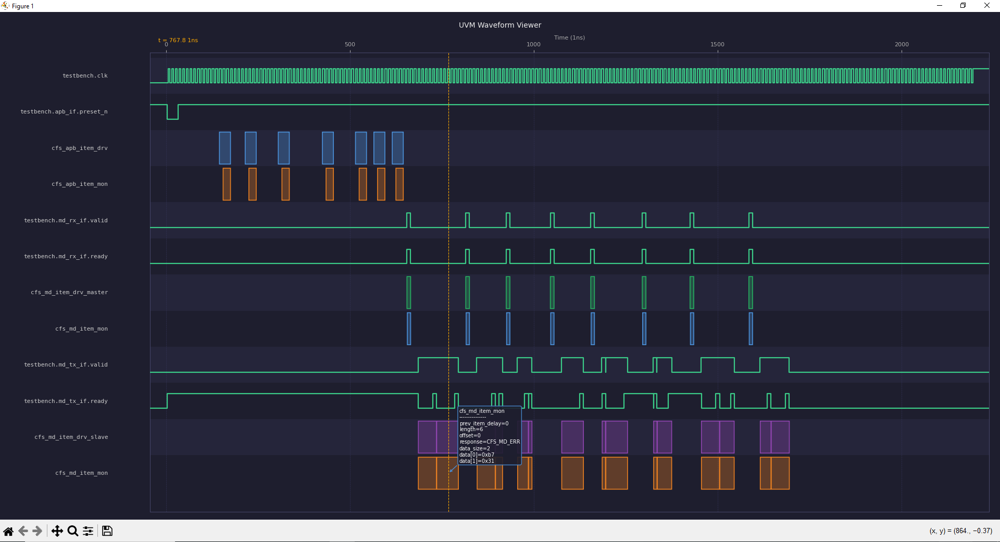

# 001 — cfs_algn_test_reg_access

**Date**: 2026-05-10  
**Seed**: -599815195   
**Verbosity**: `UVM_LOW`  

## Description
Register access test verifying APB write/read transactions 
to the CFS Aligner control registers, with MD data flow 
through RX and TX agents.

## Resources
- 📋 [Simulation log](test_random.log)
- ▶️ [Run on EDA Playground](https://edaplayground.com/x/Skwx)

## Waveform Preview

## Signals & Transactions
| Row | Type | Source |
|---|---|---|
| clk | Signal | VCD |
| preset_n | Signal | VCD |
| APB Driver | Transaction | `apb_drv.json` |
| APB Monitor | Transaction | `apb_mon.json` |
| MD RX Driver | Transaction | `md_rx_drv.json` |
| MD RX Monitor | Transaction | `md_rx_mon.json` |
| MD TX Driver | Transaction | `md_tx_drv.json` |
| MD TX Monitor | Transaction | `md_tx_mon.json` |