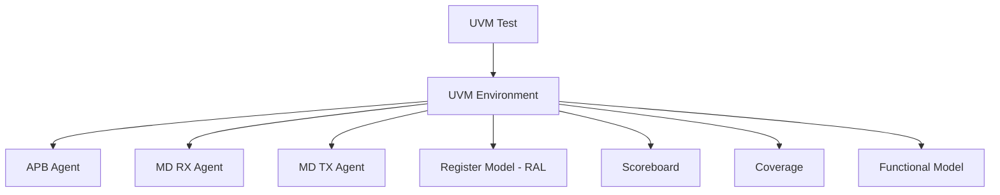
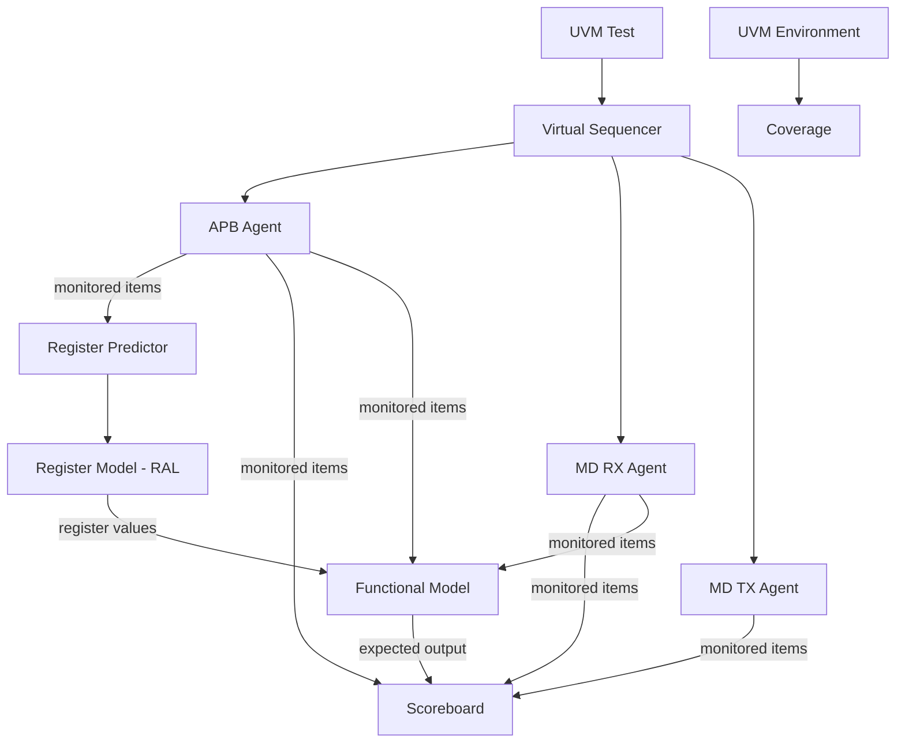

# UVM Aligner APB Verification

A UVM-based functional verification environment for a data aligner DUT 
with an APB register interface. Built as part of a self-directed learning 
project covering the full verification flow: agents, register model (RAL), 
scoreboard, functional coverage, and constrained random testing.

---

## Features

- UVM environment with APB and MD protocol agents built on a reusable `uvm_ext` base layer
- UVM Register Abstraction Layer (RAL) with APB adapter and register predictor
- Functional scoreboard with IRQ checking and watchdog timer
- Functional coverage with constrained random testing
- JSON transaction recording and waveform visualization via [uvm-json-wave-viewer](https://github.com/JohnTheo01/uvm-json-wave-viewer)
- Python scripts for automatic UVM register class generation and field insertion
- 5 bugs discovered and documented in RTL and verification model

---

## Repository Structure

```
uvm-aligner-apb-verification/
├── code/
│   ├── src/                                # RTL source files (DUT)
│   └── test/                               # UVM verification environment
│       ├── cfs_apb_pkg.sv                  # APB protocol agent
│       ├── cfs_md_pkg.sv                   # MD protocol agent
│       ├── uvm_ext_pkg.sv                  # Reusable UVM base layer
│       ├── cfs_algn_pkg.sv                 # Top-level environment package
│       ├── cfs_algn_virtual_sequences/     # Virtual sequencer & sequences
│       ├── cfs_algn_test/                  # Test classes
│       └── archive/                        # Unpacked component files (reference)
├── docs/
│   ├── bugs/                               # Bug reports (#001–#005)
│   └── waveforms/                          # Simulation waveforms & transaction data
├── scripts/                                # Python utilities
│   ├── gen_uvm_reg.py                      # UVM register class generator
│   ├── add_uvm_field.py                    # UVM register field insertion tool
│   └── sv_include_guard.py                 # Include guard generator
├── aligner_datasheet_v_1_0.pdf
└── PROGRESS.md
```

---

## Testbench Architecture

### Overview



### Detailed Connections



---

## DUT Overview

The DUT is a data aligner that receives data over an MD (multi-data) RX interface,
aligns it according to configurable offset and size parameters set via APB registers,
and outputs the aligned data over an MD TX interface.

### Key Registers (APB)

| Register | Description |
|---|---|
| `CTRL` | Controls offset, size and drop counter |
| `IRQ` | Interrupt status flags (W1C) |
| `IRQEN` | Interrupt enable mask |
| `STATUS` | DUT status flags |

---

## Tests

| Test | Description |
|---|---|
| `cfs_algn_test_reg_access` | Verifies APB register read/write access |
| `cfs_algn_test_random` | Constrained random test with full data flow |
| `cfs_algn_test_random_rx_err` | Forces illegal RX offset/size combinations via factory override |

---

## Bugs Found

| ID | Type | Description |
|---|---|---|
| [#001](docs/bugs/bug_001_offset_size_violation.md) | RTL | Illegal offset/size combination not rejected |
| [#002](docs/bugs/bug_002_fifo_level_interrupt_modeling.md) | Verification Model | False IRQ on simultaneous FIFO push/pull |
| [#003](docs/bugs/bug_003_model_pipeline_timing_mismatch.md) | Verification Model | Model pipeline runs faster than RTL |
| [#004](docs/bugs/bug_004_register_reconfiguration.md) | Verification Model | Register reconfiguration with non-empty buffers |
| [#005](docs/bugs/bug_005_max_drop_counter_irq.md) | RTL | Missing IRQ condition for max drop counter |

---

## Waveforms

Transaction recordings captured using [uvm-json-wave-viewer](https://github.com/JohnTheo01/uvm-json-wave-viewer).

| ID | Test | Description |
|---|---|---|
| [001](docs/waveforms/001_test_random/) | `cfs_algn_test_random` | APB and MD transaction recording — first waveform capture |

---

## Scripts

| Script | Description |
|---|---|
| `gen_uvm_reg.py` | Generates a UVM register class template from the command line |
| `add_uvm_field.py` | Inserts a new field into an existing UVM register file |
| `sv_include_guard.py` | Automatically adds `ifndef`/`define`/`endif` include guards to SystemVerilog files based on the filename |

---

## Getting Started

### Requirements
- [EDA Playground](https://edaplayground.com) account (free)
- Simulator: Cadence Xcelium (available on EDA Playground)
- UVM 1.2

### Running a Test
1. Open the project on [EDA Playground](#)
2. Select **Cadence Xcelium** as the simulator
3. Enable **"Download files after run"** to retrieve JSON transaction files
4. Run the simulation

### Visualizing Transactions
JSON transaction files can be visualized using [uvm-json-wave-viewer](https://github.com/JohnTheo01/uvm-json-wave-viewer).
See the viewer's README for installation and usage instructions.

---

## Skills & Tools

| Category | Details |
|---|---|
| **Language** | SystemVerilog, Python |
| **Methodology** | UVM (Universal Verification Methodology) |
| **Protocols** | AMBA APB |
| **Techniques** | Constrained random testing, functional coverage, register abstraction layer (RAL), scoreboard, virtual sequences |
| **Simulator** | Cadence Xcelium (via EDA Playground) |
| **Tools** | Git, EDA Playground |

---

## References

- [Design Verification with SystemVerilog/UVM](https://www.udemy.com/course/design-verification-with-systemverilog-uvm/) — Udemy course
- *SystemVerilog for Verification* — Chris Spear